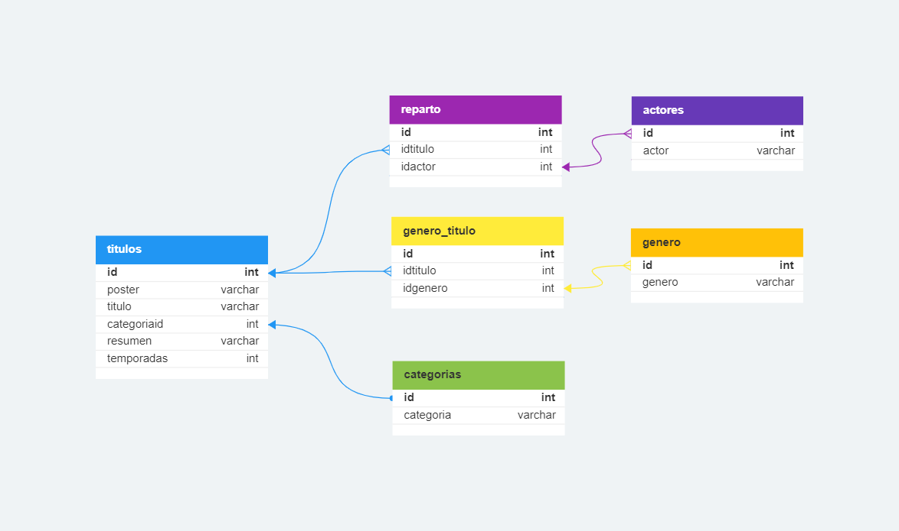

<h1>API REST TRAILERFLIX</h1>
<p>Proyecto Final Backend - Argentina Programa 4.0 </p>


<h2> Introducción</h2>
Esta documentación te guiará a realizar diferentes consultas hacia la API.

</br>

- [Instalación](#instalación)
  - [Base de datos](#base-de-datos)
  - [.env](#env)
  - [Dependencias:](#dependencias)
- [Rutas Catalogo](#rutas-catalogo)
- [Rutas Categorias](#rutas-categorias)
- [Rutas Generos](#rutas-generos)
- [Ejemplos de uso](#ejemplos-de-uso)
  - [GET contenidos](#get-contenidos)
  - [GET contenido por ID](#get-contenido-por-id)
  - [GET contenido por Nombre](#get-contenido-por-nombre)
  - [GET contenidos por Categoria](#get-contenidos-por-categoria)
  - [DELETE de generos](#delete-de-generos)


# Instalación

## Base de datos
En MySQL ejecuta el archivo **trailerflixDB.sql** que se encuentra en la carpeta **config**



## .env
Deberás crear en tu carpeta raíz un archivo de conexion a tu base de datos con nombre **".env"** donde incluirás las siguientes variables con tu informacion local:
```javascript
DB_SCHEMA = "trailerflix"
DB_USER = "root"
DB_PASSWORD = ""
DB_HOST = "localhost"
```

## Dependencias:
Asumiendo que tiene node.js preinstalado, asegurese de que su terminal este posicionada en la carpeta raiz del proyecto y ejecute  el siguiente comando para instalar todas las dependencias necesarias:
```
npm install
```

Ahora ya puedes comenzar a ejecutar el programa con el siguiente comando:
```
npm start
```
Comienza a realizar peticiones desde Thunder Client, Postman, u otra alternativa


<br>

# Rutas Catalogo
|MÉTODO|URL|DESCRIPCION|
|-|-|-|
|GET|http://localhost:3000/|La URL o ruta principal.
|GET| http://localhost:3000/api/catalogo | La URL general para visualizar todo el catalogo.
|GET| http://localhost:3000/api/catalogo/:id | La URL para visualizar un contenido por su código.
|GET| http://localhost:3000/api/catalogo/nombre/:nombre | La URL para visualizar un contenido/s por su nombre o parte de él.
|GET| http://localhost:3000/api/catalogo/categoria/:categoria | La URL para visualizar contenidos por una categoria o parte del nombre de la categoria.
|GET| http://localhost:3000/api/catalogo/genero/:genero | La URL para visualizar contenidos por un genero.

<br>

# Rutas Categorias
|MÉTODO|URL|DESCRIPCION|
|-|-|-|
|GET| http://localhost:3000/categorias | La URL que nos permite visualizar todas las categorias
|GET| http://localhost:3000/categorias/:id | La URL que nos permite visualizar las categorias por su ID
|DELETE| http://localhost:3000/categorias/:id | La URL que nos permite eliminar una categoria por su ID

<br>

# Rutas Generos
|MÉTODO|URL|DESCRIPCION|
|-|-|-|
|GET| http://localhost:3000/generos | La URL que nos permite visualizar todos los generos
|DELETE| http://localhost:3000/generos/:id | La URL que nos permite eliminar un genero por su ID

<br>

# Ejemplos de uso
## GET contenidos
Todas las consultas de tipo GET retornarán un formato JSON.

La URL general para visualizar todos los contenidos.
```py
http://localhost:3000/api/catalogo
```

```json
 {
        "id": 6,
        "poster": "http://localhost:3008/posters/6.jpg",
        "titulo": "Enola Holmes",
        "categoriaId": 2,
        "resumen": "La hermana menor de Sherlock, descubre que su madre ha desaparecido y se dispone a encontrarla. En su búsqueda, saca a relucir el sabueso que corre por sus venas y se encuentra con una conspiración que gira en torno a un misterioso lord, demostrando que su ilustre hermano no es el único talento en la familia.",
        "temporadas": 0,
        "trailer": ""
    },
    {
        "id": 7,
        "poster": "http://localhost:3008/posters/7.jpg",
        "titulo": "Guasón",
        "categoriaId": 2,
        "resumen": "Arthur Fleck (Phoenix) es un hombre ignorado por la sociedad, cuya motivación en la vida es hacer reír. Pero una serie de trágicos acontecimientos le llevarán a ver el mundo de otra forma. Película basada en el popular personaje de DC Comics Joker, conocido como archivillano de Batman, pero que en este film tomará un cariz más realista y oscuro.",
        "temporadas": 0,
        "trailer": "https://www.youtube.com/embed/zAGVQLHvwOY"
    },
```

## GET contenido por ID
La URL general para visualizar un contenido por su id
```py
http://localhost:3000/api/catalogo/15 
```
```json
{
    "id": 15,
    "poster": "/posters/15.jpg",
    "titulo": "Chernobyl",
    "categoriaId": 1,
    "resumen": "Sigue «la verdadera historia de una de las peores catástrofes provocadas por el hombre y habla de los valientes hombres y mujeres que se sacrificaron para salvar a Europa de un desastre inimaginable. La miniserie se centra en el desgarrador alcance del desastre de la planta nuclear que ocurrió en Ucrania en abril de 1986, revelando cómo y por qué ocurrió, además contando las sorprendentes y notables historias de los héroes que lucharon y cayeron.",
    "temporadas": 1,
    "trailer": "https://www.youtube.com/embed/s9APLXM9Ei8"
}
```


## GET contenido por Nombre
La URL que nos retorna un contenido/s por su nombre o parte de él.
```py
http://localhost:3000/api/catalogo/nombre/gam
```
```json
{
        "id": 5,
        "poster": "/posters/5.jpg",
        "titulo": "Gambito de Dama",
        "categoriaId": 1,
        "resumen": "En los cincuenta, una joven de un orfanato descubre que tiene un increíble don para el ajedrez y recorre el arduo camino a la fama mientras lucha contra las adicciones.",
        "temporadas": 1,
        "trailer": ""
    },
    {
        "id": 8,
        "poster": "/posters/8.jpg",
        "titulo": "Avengers: End Game",
        "categoriaId": 2,
        "resumen": "Después de los devastadores eventos de los Vengadores: Infinity War (2018), el universo está en ruinas. Con la ayuda de los aliados restantes, los Vengadores se reúnen una vez más para revertir las acciones de Thanos y restaurar el equilibrio del universo.",
        "temporadas": 0,
        "trailer": ""
    }
```


## GET contenidos por Categoria
La URL que nos retorna un contenido/s por su categoria.
```py
http://localhost:3000/api/catalogo/categoria/pelicula
```

```json
 {
        "id": 7,
        "poster": "/posters/7.jpg",
        "resumen": "Arthur Fleck (Phoenix) es un hombre ignorado por la sociedad, cuya motivación en la vida es hacer reír. Pero una serie de trágicos acontecimientos le llevarán a ver el mundo de otra forma. Película basada en el popular personaje de DC Comics Joker, conocido como archivillano de Batman, pero que en este film tomará un cariz más realista y oscuro.",
        "temporadas": 0,
        "titulo": "Guasón",
        "trailer": "https://www.youtube.com/embed/zAGVQLHvwOY",
        "categorias": "Película",
        "genero": "Crimen, Suspenso, Drama",
        "actores": "Joaquin Phoenix, Robert De Niro, Zazie Beetz, Frances Conroy, Brett Cullen, Shea Whigham"
    }
```


## DELETE de generos
La URL que nos permite eliminar un recurso existente
```py
http://localhost:3000/generos/20
```
Response:
```json
  {
    "mensaje": "Genero eliminado con éxito"
  }
```
